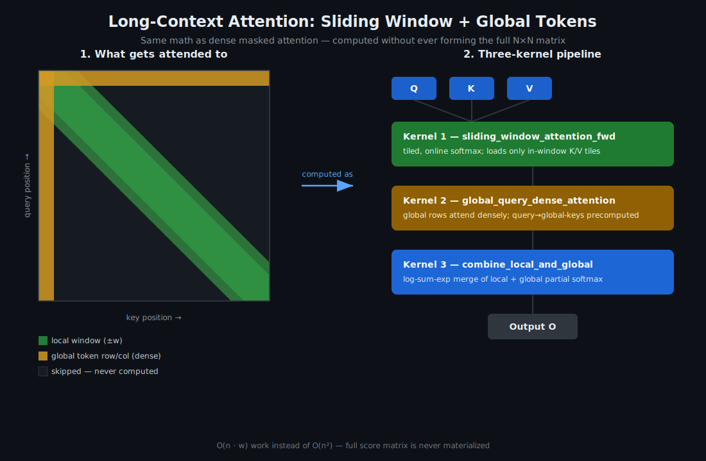

# Long-Context Attention Kernels

<p align="center">
  
</p>

CUDA kernels for **sliding-window + global-token attention** (Longformer / BigBird-style
sparse attention). Standard attention is `O(n^2)` in sequence length, which makes
32K–128K-token contexts painful. This project implements the sparse attention pattern
directly as a fused CUDA kernel instead of materializing the full attention matrix and
masking it — the approach most tutorials use, and the approach that wastes the most
compute and memory.

This is a companion project to
[cuda-ml-kernels](https://github.com/data-geek-astronomy/cuda-ml-kernels), which covers
dense Flash Attention, fused LayerNorm+GELU, INT8 quantization, and tiled GEMM, and to
[`cuda-fusion-compiler/`](cuda-fusion-compiler) in this repo, a small compiler that
auto-fuses chains of elementwise CUDA ops into a single generated kernel. This repo
focuses on the sparse long-context case, which has far less open-source CUDA coverage than
dense transformer attention.

## The problem

Given a sequence of length `n`, most long-context transformers don't need full `n x n`
attention. Longformer-style models restrict most tokens to a local **sliding window** of
size `w`, and give a small set of **global tokens** (e.g. `[CLS]`, task tokens) full
attention to and from every position. This turns attention into effectively `O(n * w)`
work — but only if the kernel actually skips the masked-out blocks instead of computing
them and zeroing them out.

## What's inside

### 1. Sliding window attention kernel (`csrc/sliding_window_attention.cu`)
- Each query only attends to keys within `[i - w, i + w]` (configurable window radius).
- Tiled into shared-memory blocks aligned to the window, so out-of-window key/value tiles
  are never loaded, not just masked.
- Online softmax (Flash-Attention-style running max/sum) so the full score matrix is never
  materialized, even within a window.

### 2. Global token attention kernel (`csrc/global_attention.cu`)
- A small, configurable set of global-token indices gets dense attention to/from all `n`
  positions.
- Implemented as a separate, smaller GEMM-heavy kernel since the access pattern
  (dense rows/columns in an otherwise sparse matrix) differs from the windowed case.

### 3. Fused combine step (`csrc/combine.cu`)
- Merges the windowed-local and global-attention outputs (they touch overlapping token
  positions) using log-sum-exp accumulation, so the final output is mathematically
  equivalent to computing full attention with the Longformer mask, without ever forming
  it.

## Build

```bash
git clone <this repo>
cd long-context-attention-kernels
pip install torch numpy pybind11
mkdir build && cd build
cmake .. -DCMAKE_BUILD_TYPE=Release
make -j$(nproc)
pip install ..
```

Requires CUDA 11.0+ and an Ampere-or-newer GPU (uses `__shfl_down_sync` warp reductions;
tested tile sizes assume 128KB+ shared memory per SM).

## Usage

```python
import torch
import long_context_attention as lca

seq_len = 16384
window = 256          # each token attends to +/- 256 neighbors
global_idx = [0, 1, 2] # e.g. CLS + 2 task tokens get full attention

Q = torch.randn(1, seq_len, 64, device="cuda", dtype=torch.float16)
K = torch.randn(1, seq_len, 64, device="cuda", dtype=torch.float16)
V = torch.randn(1, seq_len, 64, device="cuda", dtype=torch.float16)

out = lca.sliding_window_attention(
    Q, K, V,
    window_size=window,
    global_tokens=global_idx,
    scale=1.0 / 8.0,
)
```

## Benchmarking

```bash
python benchmarks/bench.py --seq-len 16384 32768 65536 --window 256
```

Expect roughly linear scaling in `seq_len` for the windowed kernel, vs. quadratic for a
naive masked-dense baseline (`benchmarks/bench.py` includes both for comparison).

## Correctness

`tests/test_correctness.py` checks the sparse kernel's output against a reference
PyTorch implementation that builds the full Longformer attention mask densely and runs
softmax attention — the sparse and dense paths should match within fp16 tolerance.

```bash
pytest tests/
```

## Status / roadmap

- [x] Sliding window forward kernel
- [x] Global token forward kernel
- [x] Combine step
- [ ] Backward pass (training support)
- [ ] Dilated windows (Longformer's dilation variant)
- [ ] Variable window size per layer

## License

MIT
